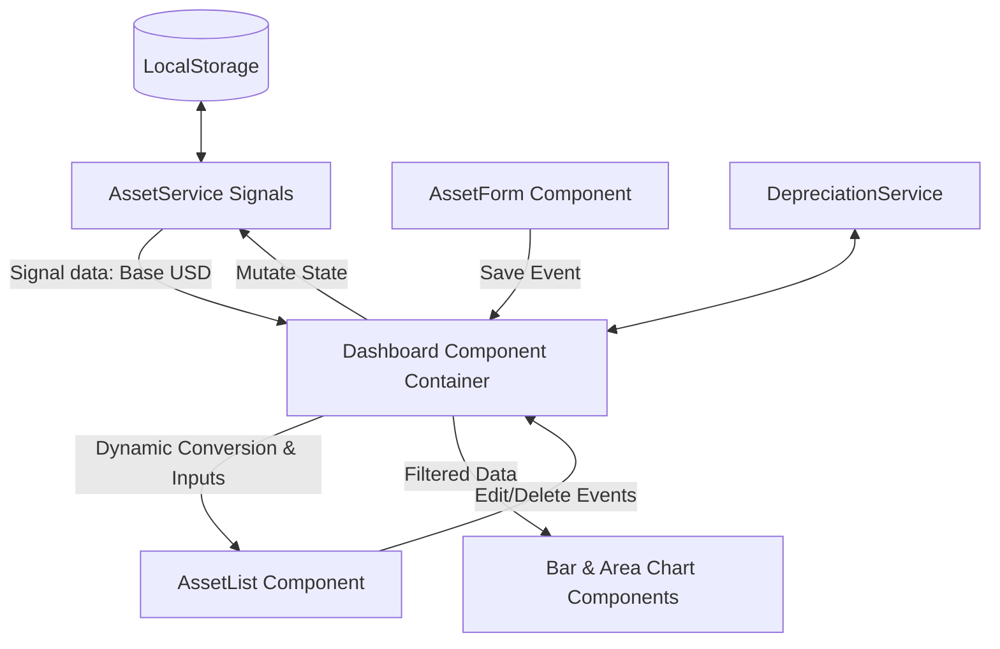

# Design: Corporate Assets Manager

## Technical Approach
An interactive corporate asset management dashboard built on Angular v22. We use a container-presentational pattern to separate data fetching, state management, and business logic from UI rendering. All local state is reactive, managed via Angular Signals within services, and persisted to `localStorage`. Calculations are delegated to a dedicated utility service, and visualization is performed natively using lightweight custom SVG components styled with Tailwind CSS v4.

## Architecture Decisions

### Decision: State Management and Reactivity
| Option | Tradeoff | Decision |
|--------|----------|----------|
| **RxJS / NgRx** | Excessive boilerplate, high learning curve; overkill for local client state. | *Reject* |
| **Angular Signals** | Native, lightweight, synchronous reactivity. Perfect for v22 standalone components. | **Select** |

### Decision: Visual Charting
| Option | Tradeoff | Decision |
|--------|----------|----------|
| **Chart.js / D3.js** | Large bundle size, extra dependencies, complexity in Angular lifecycle wrapper. | *Reject* |
| **Custom SVG Components** | Hand-coded paths; highly performant, fully responsive, zero-dependency, easy Tailwind v4 styling. | **Select** |

### Decision: Currency Valuation Strategy
| Option | Tradeoff | Decision |
|--------|----------|----------|
| **Convert on Save** | Causes rounding errors/drift and data integrity issues if rates change. | *Reject* |
| **USD-Base Persistence** | Single source of truth in USD; dynamic conversion at view-time via computed signals. | **Select** |

## Data Flow


## File Changes

| File | Action | Description |
|------|--------|-------------|
| `src/app/models/asset.model.ts` | Create | Contains TypeScript interfaces for `Asset`, `Currency`, and depreciation projections. |
| `src/app/services/asset.service.ts` | Create | Signal-based service for CRUD operations, mock data, and LocalStorage persistence. |
| `src/app/services/depreciation.service.ts` | Create | Pure logic service for straight-line calculations and input validation. |
| `src/app/components/dashboard/dashboard.component.ts` | Create | Container component managing service injection, currency toggling, and layout orchestration. |
| `src/app/components/asset-list/asset-list.component.ts` | Create | Presentational table with search, category filtering, and edit/delete triggers. |
| `src/app/components/asset-form/asset-form.component.ts` | Create | Modal/form component with validations for creating and modifying assets. |
| `src/app/components/charts/bar-chart.component.ts` | Create | SVG-based responsive bar chart showing asset distribution per category. |
| `src/app/components/charts/area-chart.component.ts` | Create | SVG-based area chart showing depreciation projection trajectory over time. |
| `src/app/app.routes.ts` | Modify | Route mapping pointing the default path to `DashboardComponent`. |
| `src/app/app.html` | Modify | Clean default boilerplate, replace with `<router-outlet>`. |

## Interfaces / Contracts

### Asset & Currency Models (`src/app/models/asset.model.ts`)
```typescript
export interface Asset {
  id: string;
  name: string;
  type: 'physical' | 'non-physical';
  category: string;
  purchaseDate: string; // YYYY-MM-DD
  purchaseValue: number; // in USD
  residualValue: number; // in USD
  usefulLife: number; // in years
  serialNumber?: string;
  location?: string;
}

export type Currency = 'USD' | 'EUR' | 'ARS';

export interface DepreciationPoint {
  year: number;
  remainingValue: number;
  accumulatedDepreciation: number;
}
```

### Services
* **AssetService**:
  * `assets: Signal<Asset[]>`
  * `selectedCurrency: WritableSignal<Currency>`
  * `addAsset(asset: Omit<Asset, 'id'>): void`
  * `updateAsset(id: string, asset: Asset): void`
  * `deleteAsset(id: string): void`
  * `convert(usdVal: number): number` (computed rate conversion helper)
* **DepreciationService**:
  * `calculateYearly(val: number, resid: number, life: number): number`
  * `getTrajectory(val: number, resid: number, life: number): DepreciationPoint[]`

## Testing Strategy
We will implement unit tests targeting logic correctness since integration tests are currently limited by environment configs.

| Layer | What to Test | Approach |
|-------|-------------|----------|
| **Unit** | `DepreciationService` | Verify math correctness and validation errors for invalid useful life (<=0) or residual value > purchase value. |
| **Unit** | `AssetService` | Verify local storage load, mock fallback, and CRUD signal emissions. |
| **Component** | Custom SVG Charts | Verify that correct SVG heights and path points are calculated based on mock inputs. |

## Migration / Rollout
No database migration is required. LocalStorage will initialize with mock data if no key exists.

## Open Questions
* **Exchange Rates**: Mock rates are hardcoded (`USD: 1.0`, `EUR: 0.9`, `ARS: 1000.0`). Is this hardcoded setup sufficient for production requirements, or should we design the API client interface for potential future extension? *Assumed mock rates are sufficient.*
